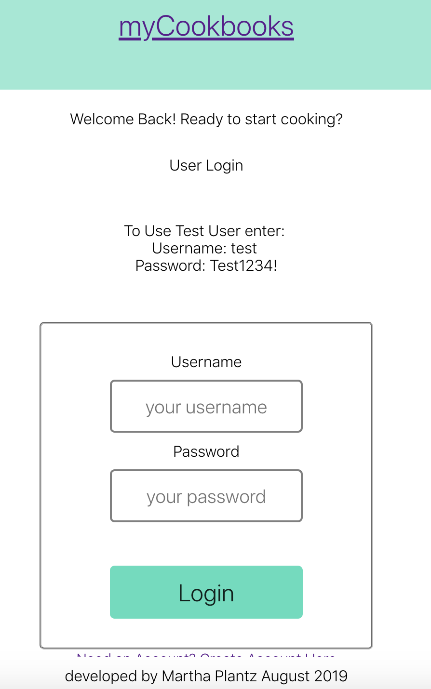
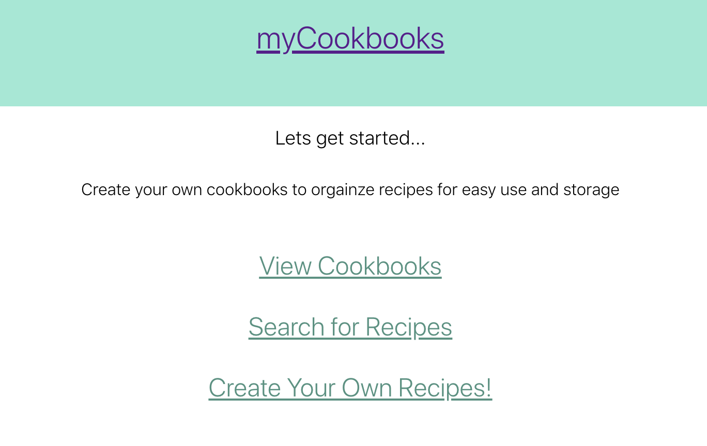
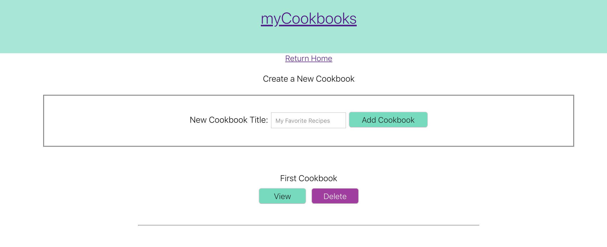
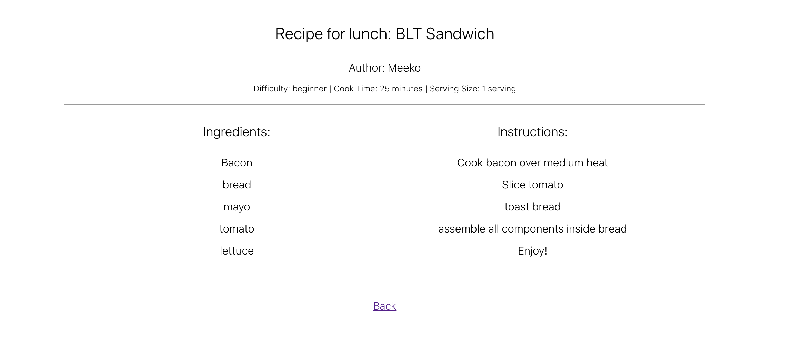
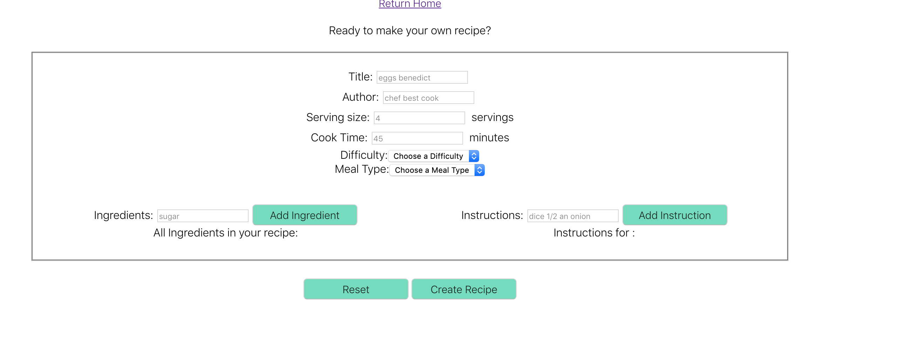

#Application Title: MyCookbook App

Link to live application: https://my-cookbook-app.maplantz89.now.sh/

##API Documentation
Routes within this Application:
1. /api/cookbooks
  GET request: allows client to recieve an array of cookbook objects
  POST request: allows client to create a new cookbook and add it to the database

2. /api/recipes
  GET request: allows client to recieve an array of recipe objects
  POST request: allows client to create a new recipe and add it to the database

3. /api/cookbooks/:cookbook_id
  GET request: allows client to recieve an individual cookbook
  DELETE request: allows client to delete an individual cookbook
  PATCH request: allows client to change the either the title or recipes array
   
    (each cookbook has an array of recipe id which that cookbook contains)

4. /api/recipes/:recipe_id
  GET request: allows client to recieve an individual recipe

##Screenshots of myCookbook App

#Summary of Application
This cookbook application allows users to search, create and organize recipes into multiple cookbooks. This will make organization for home cooks expontentially better. 

Future Ideas:
1. This application also has sights for catering to restaurants who rotate through different cookbooks/menus. 
2. Allow rating of recipes/cookbook 

#Technology used: 
React 
HTML
JavaScript
Node.js
PostgresSQL
Express
CSS